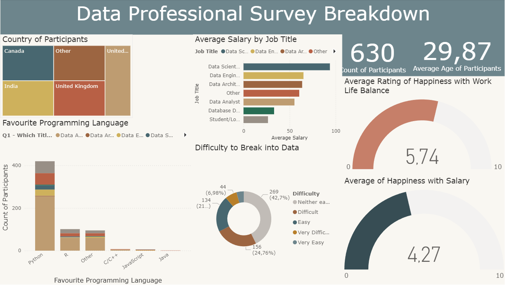

#  Power BI Dashboard — Data Professional Survey Breakdown
 
## Project Overview
This project visualises the results of a survey completed by **650 data professionals** across various roles, countries, and experience levels. Using **Power BI Desktop**, the raw survey data was cleaned and transformed using **Power Query**, then visualised in an interactive dashboard that communicates key insights about the data industry — salaries, job satisfaction, tool preferences, and career difficulty.
 
 
---
 
## Dashboard Preview

 
---
 
##  Tools Used
- **Power BI Desktop**
- **Power Query** — data cleaning and transformation
- **DAX** — calculated measures and aggregations
- Charts used: Stacked bar charts, treemap, donut chart, gauge charts, card visuals
---
 
##  Dataset
- **Records:** 650 survey responses from data professionals
- **Key fields:** Job title, country, salary (USD), programming language preference, work-life balance rating, salary satisfaction rating, difficulty breaking into data, age, gender, education level
---
 
##  Project Workflow
 
### 1. Data Connection
Connected Power BI directly to the raw survey Excel file as the data source.
 
### 2. Data Cleaning in Power Query
Before building any visuals, the raw survey data required significant cleaning:
- Removed unnecessary columns not relevant to the analysis
- Split and cleaned the salary column — survey respondents provided salary ranges (e.g. "70k–90k") which were split and averaged into a single numeric value for analysis
- Standardised job title and country responses — open-text fields contained many variations that were grouped into cleaner categories (e.g. "Data Analyst", "Data Engineer", "Data Scientist", "Other")
- Cleaned programming language responses in the same way — grouping variations into primary language categories
### 3. DAX Measures
Calculated measures were created to power the dashboard visuals, including:
- Average salary by job title
- Average age of survey respondents
- Average satisfaction scores for work-life balance and salary
### 4. Dashboard Design
All visuals were arranged on a single dashboard page with a clean, consistent layout:
 
| Visual | Insight |
|---|---|
| **Treemap** | Survey takers by country — showing geographic distribution |
| **Stacked bar chart** | Average salary by job title — comparing earning potential across roles |
| **Stacked bar chart** | Favourite programming language by job title — showing Python's dominance |
| **Donut chart** | Difficulty breaking into data — how hard respondents found entering the field |
| **Gauge chart** | Average work-life balance satisfaction score |
| **Gauge chart** | Average salary satisfaction score |
| **Card visuals** | Total survey count and average age of respondents |
 
---
 
##  Key Skills Demonstrated

| Skill | Application |
|---|---|
| Power Query | Data cleaning, column splitting, text grouping, type conversion |
| DAX | Calculated measures for averages and aggregations |
| Data Modelling | Structured clean data ready for visual consumption |
| Dashboard Design | Single-page layout with consistent theme and clear visual hierarchy |
| Chart Selection | Appropriate chart types chosen for each data dimension |
| Storytelling | Dashboard communicates a coherent narrative about the data profession |
 
---
 
##  Key Insights from the Dashboard
- **Data Scientists** earn the highest average salary among all roles surveyed, followed by Data Engineers
- **Python** is the most popular programming language across virtually all data roles
- The majority of respondents found breaking into the data field **"difficult" or "very difficult"** — highlighting the value of a strong portfolio
- Average **work-life balance satisfaction** scored higher than **salary satisfaction** across respondents, suggesting compensation remains a key concern in the industry
- The **United States, India, and the United Kingdom** represented the largest share of survey respondent

